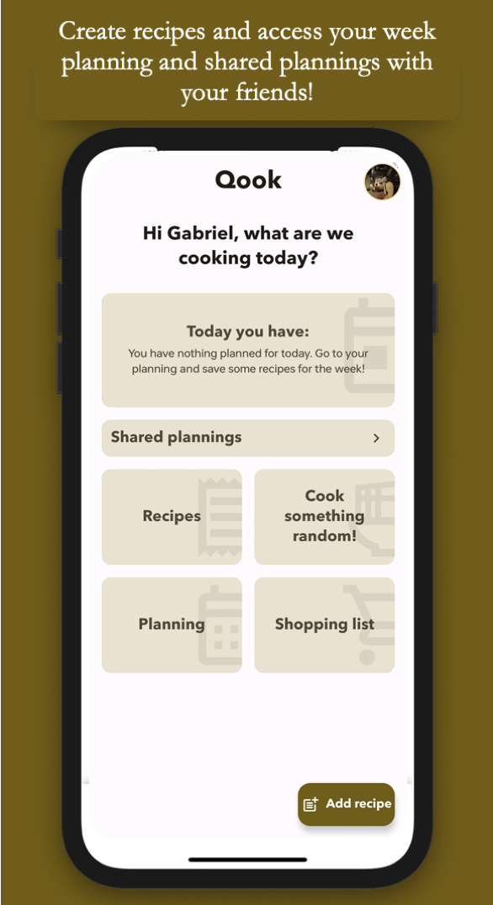
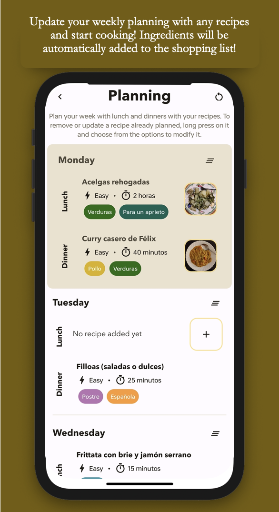
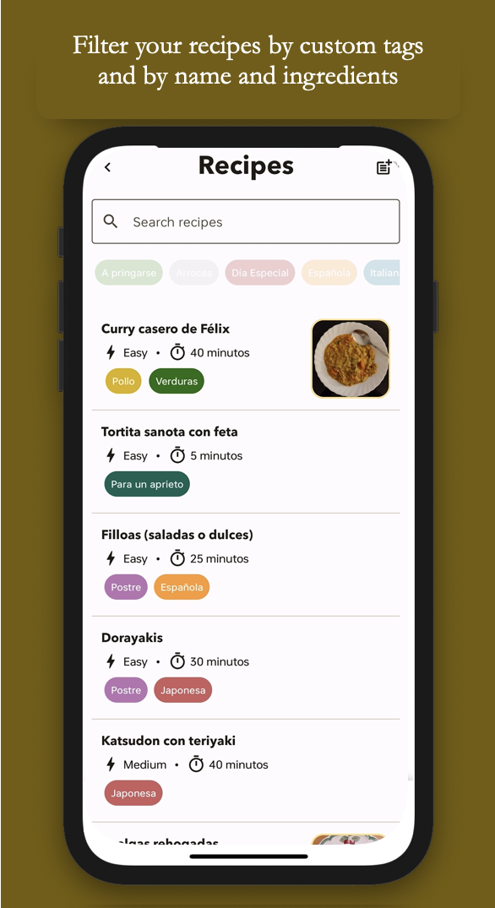
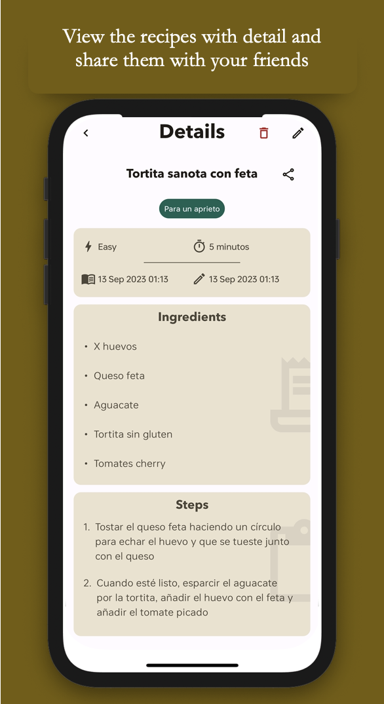

# Qook

Manage recipes and plan your lunches in a weekly basis with this easy-to-use android app! 

App made with native Kotlin with Jetpack Compose for Android. Using coroutines, Hilt and Dagger, flows and view model; all with a clean architecture following the DDD standards.

    

## Screenshots

  
  
  
  
  

## Description

Plan your week with your recipes and share plannings with others!

Create recipes from your daily basis meals and add them to your recipe list. With those, create weekly plannings for your meals: lunch and dinner! 

Every week, the planning will reset in order to create a new one for the upcoming week. 

All recipes' ingredients added to the planning will be automatically added to the Shopping List, where you can manage when going out grocering shopping.

You can also create a Shared Planning with friends following the same principles, but now everyone in the group can add recipes to the planning!
